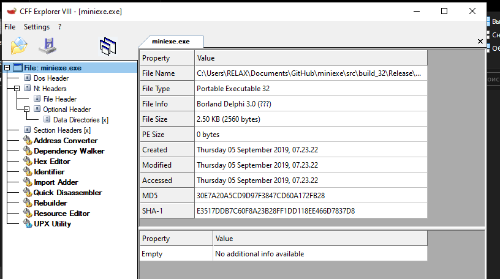
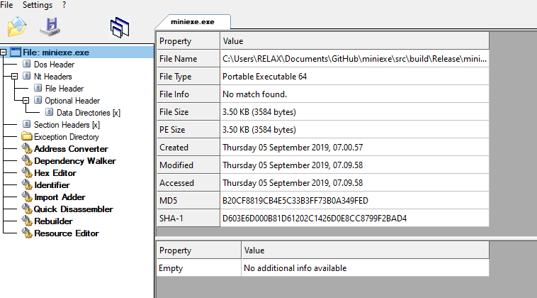

# miniexe 
A way to creating small executables with Microsoft Visual Studio, without import directory, remove the `C runtime` library initialization code, but can dynamic call C standard library from msvcrt.dll. 
 
All windows `API` and `C API` dynamic load from `DLL`, include `Loadlibrary`, so we can build an `EXE` without import directory.

## How to work? 
 1. Get `kernel32.dll` base from PEB 
 2. Get `LoadLibraryA`, ... API address from `kernel32.dll` base 
 3. Load `user32.dll` and `msvcrt.dll` 
 4. Get others `API` by loaded mod's export table 
 5. Spec our entry point, do not link default `C run time`(/NODEFAULTLIB) 
 
## How to spec entry point? 
Realize `mainCRTstartup` function, by [miniCRT](https://github.com/flydom/MiniCRT) 

## How to build? 
Use `Cmake-GUI` or console version if u want.

## Results 
On my PC, size of EXE only 2560Bytes(2.5 KB), it could be smaller, no run time dependence, all DLLs are windows original.

x86

x64 

